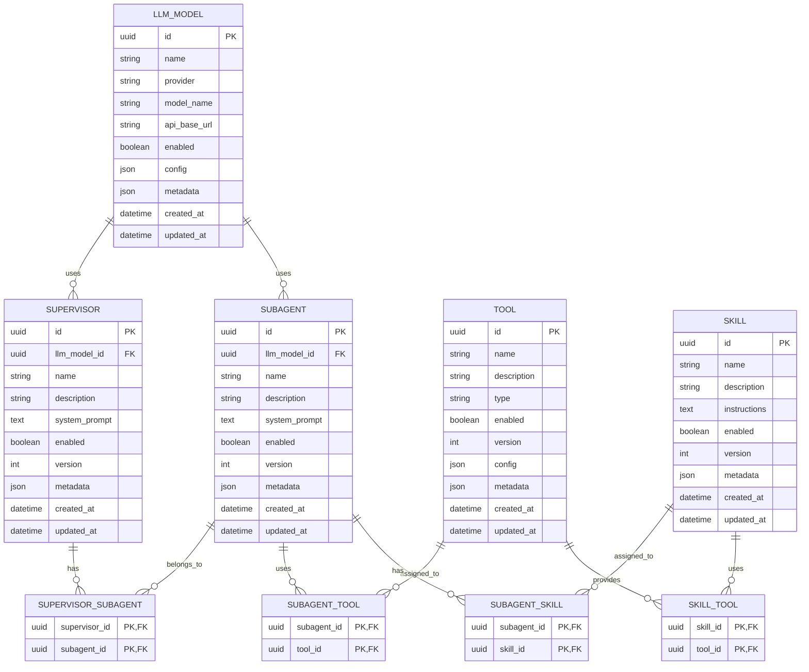

```mermaid
erDiagram
    LLM_MODEL ||--o{ SUPERVISOR : uses
    LLM_MODEL ||--o{ SUBAGENT : uses

    SUPERVISOR ||--o{ SUPERVISOR_SUBAGENT : has
    SUBAGENT ||--o{ SUPERVISOR_SUBAGENT : belongs_to

    SUBAGENT ||--o{ SUBAGENT_TOOL : uses
    TOOL ||--o{ SUBAGENT_TOOL : assigned_to

    SUBAGENT ||--o{ SUBAGENT_SKILL : has
    SKILL ||--o{ SUBAGENT_SKILL : assigned_to

    SKILL ||--o{ SKILL_TOOL : uses
    TOOL ||--o{ SKILL_TOOL : provides

    LLM_MODEL {
        uuid id PK
        string name
        string provider
        string model_name
        string api_base_url
        boolean enabled
        json config
        json metadata
        datetime created_at
        datetime updated_at
    }

    SUPERVISOR {
        uuid id PK
        uuid llm_model_id FK
        string name
        string description
        text system_prompt
        boolean enabled
        int version
        json metadata
        datetime created_at
        datetime updated_at
    }

    SUBAGENT {
        uuid id PK
        uuid llm_model_id FK
        string name
        string description
        text system_prompt
        boolean enabled
        int version
        json metadata
        datetime created_at
        datetime updated_at
    }

    SKILL {
        uuid id PK
        string name
        string description
        text instructions
        boolean enabled
        int version
        json metadata
        datetime created_at
        datetime updated_at
    }

    TOOL {
        uuid id PK
        string name
        string description
        string type
        boolean enabled
        int version
        json config
        json metadata
        datetime created_at
        datetime updated_at
    }

    SUPERVISOR_SUBAGENT {
        uuid supervisor_id PK, FK
        uuid subagent_id PK, FK
    }

    SUBAGENT_TOOL {
        uuid subagent_id PK, FK
        uuid tool_id PK, FK
    }

    SUBAGENT_SKILL {
        uuid subagent_id PK, FK
        uuid skill_id PK, FK
    }

    SKILL_TOOL {
        uuid skill_id PK, FK
        uuid tool_id PK, FK
    }

```
